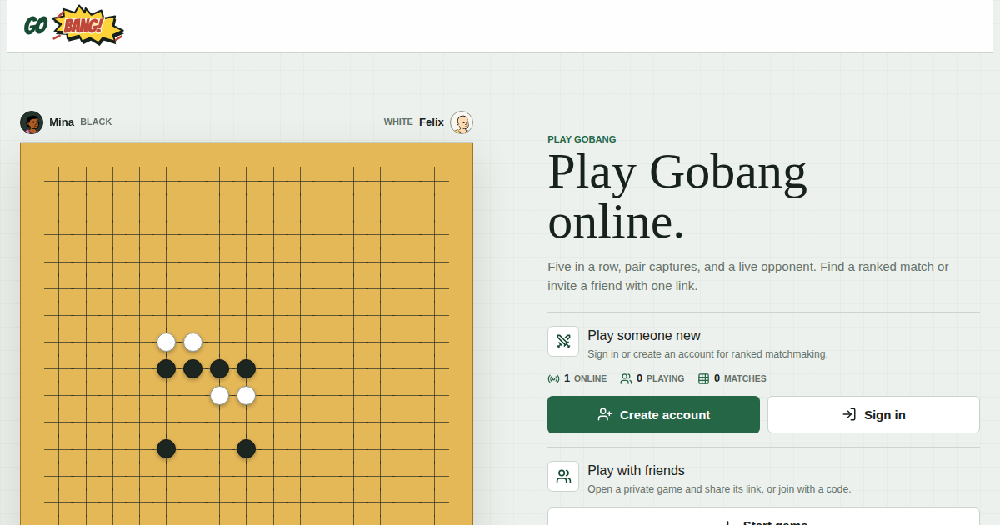

# Gobang

<p align="center">
  
</p>

A real-time, two-player implementation of Gobang (Five in a Row), built for the web and Android. Create a private game link to play with a friend, or sign in to compete in ranked matchmaking.

## Features

- Private invite links for two-player games
- Ranked matchmaking, Elo ratings, leaderboards, and match history
- Gobang captures: bracketed pairs are removed, and the affected intersections are blocked for the next move
- Guest play with optional account upgrade, email/password, and Google sign-in
- Real-time game state, invitations, reactions, presence, and push notifications
- Local games against a Rust/WASM bot
- Capacitor Android app with verified game links and Firebase Cloud Messaging

## Architecture

| Layer | Technology | Responsibility |
| --- | --- | --- |
| Client | Vue 3, Vite, TypeScript | Lobby, board, profiles, realtime UI, and Capacitor shell |
| Game API | FastAPI, Python | Authoritative rules, matchmaking, game actions, and notifications |
| Data and realtime | PocketBase | Accounts, persistence, migrations, and SSE updates |
| Bot | Rust compiled to WebAssembly | In-browser local opponent |
| Edge | Caddy | Same-origin routing for `/api` and `/pb` |

## Quick Start

### Requirements

- Docker and Docker Compose
- Node.js 22+ and npm for frontend development
- [uv](https://docs.astral.sh/uv/) for backend development
- Rust with the `wasm32-unknown-unknown` target for local bot builds

Run the full local stack:

```sh
cp .env.example .env
# Set PB_SUPERUSER_EMAIL and PB_SUPERUSER_PASSWORD in .env.
docker compose up --build
```

Open [http://localhost:8080](http://localhost:8080). Start a game in one browser and open its invite URL in another.

PocketBase data persists in Docker's `pocketbase_data` volume. Do not remove that volume unless intentionally resetting local data.

## Development

Install JavaScript dependencies and the Rust WASM target once:

```sh
npm install
rustup target add wasm32-unknown-unknown
```

For a fast frontend loop, start PocketBase and the API in separate terminals, then launch Vite:

```sh
docker compose up pocketbase
uv run --directory backend uvicorn app.main:app --reload --port 8000
npm run dev
```

The production build expects `/api` and `/pb` at one origin. Use the full Compose stack when testing that routing locally.

### Useful Commands

| Command | Purpose |
| --- | --- |
| `npm run dev` | Build the bot and start the Vite dev server |
| `npm run build-only` | Build the production web app |
| `npm run type-check` | Run Vue and TypeScript checks |
| `npm run lint` | Run Oxlint and ESLint with fixes |
| `npm run test:unit` | Run frontend unit tests |
| `uv run --directory backend pytest` | Run backend tests |
| `uv run --directory backend ruff check app tests` | Lint the backend |
| `npm run test:e2e` | Run Playwright browser tests against the configured stack |

## Android

The Android app wraps the Vue client with Capacitor and uses the same deployed API and PocketBase instance.

```sh
cp .env.android.example .env.android.local
# Set VITE_API_BASE_URL to the public HTTPS origin.
npm install
npm run android:build
```

This produces a debug APK at `android/app/build/outputs/apk/debug/app-debug.apk`. Run `npm run android:open` to open the native project in Android Studio. Android builds require Android SDK 36 and JDK 21.

## Testing

Run the checks appropriate for your change:

```sh
uv run --directory backend pytest
uv run --directory backend ruff check app tests
npm run type-check
npm run test:unit
npm run build-only
docker compose config
```

End-to-end tests target `http://127.0.0.1:18080` by default. Start a compatible test stack first, or set `E2E_BASE_URL` to a running instance:

```sh
E2E_BASE_URL=http://localhost:8080 npm run test:e2e
```

## Configuration and Deployment

Copy `.env.example` for the Docker environment. It documents the PocketBase superuser, optional SMTP and Google OAuth settings, Firebase credentials, Android App Link fingerprints, and public legal-notice data. Keep credentials in environment variables; do not commit them.

The deployment consists of three services defined in `compose.yaml`:

- `pocketbase` stores application data and emits realtime updates.
- `app` serves the FastAPI API and the built frontend.
- `caddy` exposes the single public origin and forwards `/api` and `/pb`.

Production hosts should expose only Caddy publicly. PocketBase has a persistent volume and should not be run with concurrent writers.

## Project Layout

```text
src/          Vue client, views, components, and local WASM integration
backend/      FastAPI application and Python tests
bot-engine/   Rust game bot compiled to WebAssembly
pocketbase/   PocketBase image, hooks, and database migrations
android/      Capacitor Android project
e2e/          Playwright browser tests
```

## License

No license is currently declared. All rights are reserved unless the repository owner adds a license file.
